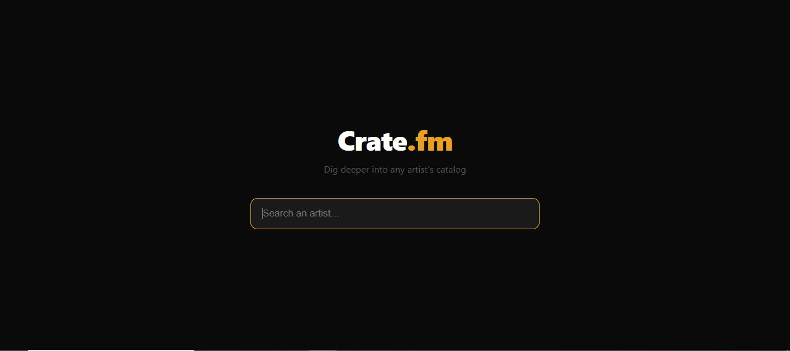
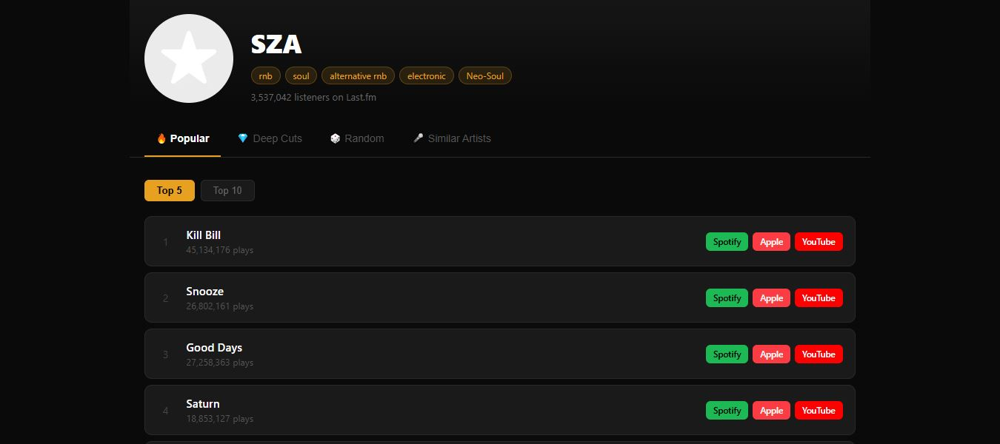
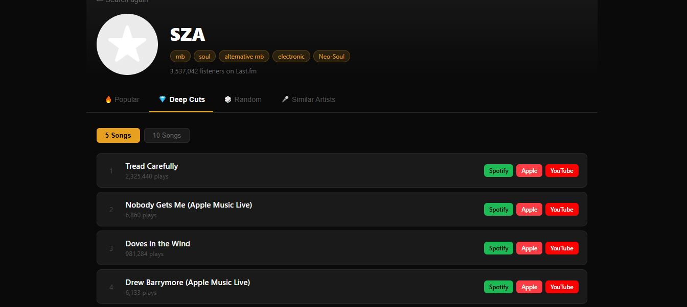
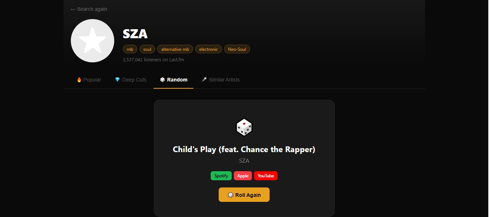

# Crate.fm

A music discovery app that helps you dig deeper into any artist's catalog. Search any artist and explore their music through four distinct lenses.

## Preview

### Landing Page

### Popular

### Deep Cuts

### Random

## Features

- 🔥 **Popular** — The most played tracks, ranked by global play count
- 💎 **Deep Cuts** — Genuinely obscure tracks from deeper in the catalog, away from the hits
- 🎲 **Random** — One completely random track from a wide pool of 200 songs
- 🎤 **Similar Artists** — Discover who to explore next, fully clickable to keep digging

## How It Works

1. Search for any artist
2. Pick a discovery mode from the tabs
3. Choose 5 or 10 songs (Popular and Deep Cuts)
4. Listen via Spotify, Apple Music, or YouTube Music

## Tech Stack

- **Backend:** Python, Flask
- **API:** Last.fm
- **Frontend:** HTML, CSS, JavaScript

## Setup & Installation

1. Clone the repo
git clone https://github.com/JoshVarughese/crate-fm.git
cd crate-fm

2. Create and activate a virtual environment
python -m venv venv
venv\Scripts\activate

3. Install dependencies
pip install -r requirements.txt

4. Create a `.env` file and add your Last.fm API key
LASTFM_API_KEY=your_api_key_here

5. Run the app
python app.py

6. Open your browser and go to `http://localhost:5000`

## Getting a Last.fm API Key

Get a free API key at [last.fm/api](https://www.last.fm/api/account/create).